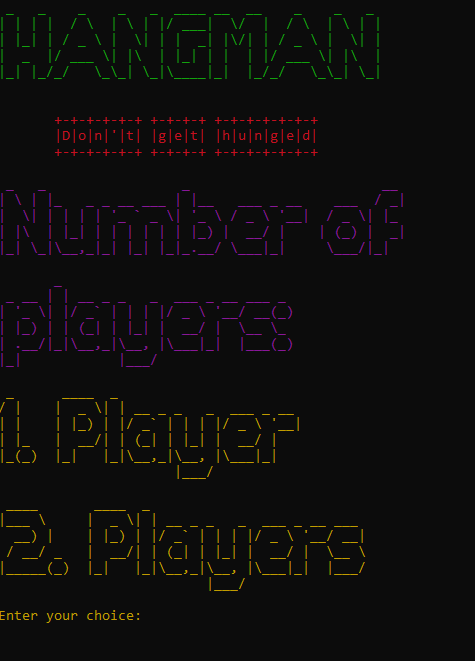
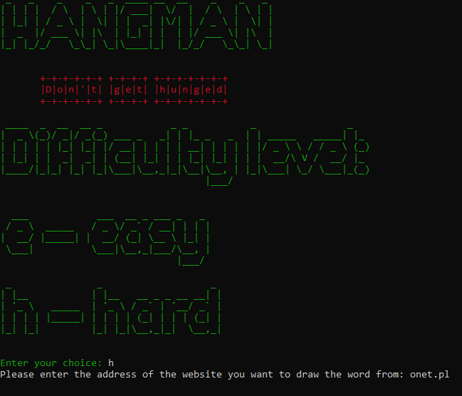
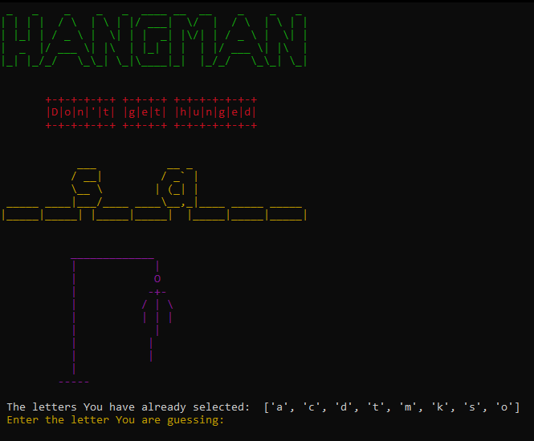
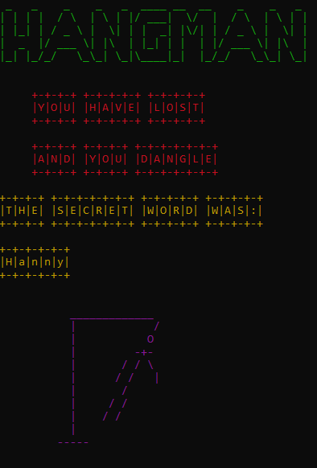

# Hangman in Python

  
  
  
  

## Table of Contents
- [Introduction](#introduction)
- [Features](#features)
- [Installation](#installation)
- [Usage](#usage)
- [Gameplay](#gameplay)
- [Screenshots](#screenshots)
- [Dependencies](#dependencies)
- [Notes](#notes)
- [License](#license)


## Introduction

Welcome to **Hangman in Python**! This classic word-guessing game has been enhanced with engaging ASCII animations, providing an enjoyable experience for players of all ages. Whether you're playing solo or with friends, Hangman offers a fun challenge to test your vocabulary and guessing skills.

## Features

- **ASCII Animations:** Visually appealing ASCII art that brings the game to life.
- **Two Difficulty Levels:**
  - **Easy:** Choose from a predefined list of words.
  - **Hard:** Words are randomly fetched from a website of your choice.
- **Player Modes:** Play solo or with another player.
- **Interactive Interface:** Clear and colorful terminal outputs enhance the gaming experience.
- **Cross-Platform Compatibility:** Runs smoothly on Windows, Linux, and macOS.

## Installation

1. **Clone the Repository:**
    ```bash
    git clone https://github.com/yourusername/hangman-python.git
    cd hangman-python
    ```

2. **Create a Virtual Environment (Optional but Recommended):**
    ```bash
    python3 -m venv venv
    source venv/bin/activate  # On Windows: venv\Scripts\activate
    ```

3. **Install Dependencies:**
    ```bash
    pip install -r requirements.txt
    ```

    *If a `requirements.txt` file is not provided, install the necessary packages manually:*
    ```bash
    pip install beautifulsoup4 requests termcolor pyfiglet
    ```

## Usage

1. **Run the Game:**
    ```bash
    python hangman.py
    ```

2. **Using PyCharm:**
   - Open the project in PyCharm.
   - Go to **Run > Edit Configurations**.
   - In the **Run Configuration Settings**, ensure the correct script (`hangman.py`) is selected.
   - Click **Run** to start the game.

## Gameplay

1. **Start Screen:**
   - The game begins with an animated Hangman title screen.

2. **Player Mode Selection:**
   - Choose between single-player or two-player modes.

3. **Difficulty Level:**
   - **Easy:** Select a word from a predefined list.
   - **Hard:** Enter a website URL from which the game will fetch a random word.

4. **Guessing Letters:**
   - Enter one letter at a time to guess the hidden word.
   - Incorrect guesses will add parts to the hangman figure.
   - The game continues until you either guess the word correctly or the hangman is fully drawn.

5. **End Game:**
   - After the game concludes, choose to play again or exit.

## Screenshots

  
*Main Interface*

  
*Gameplay Screen*

  
*Victory Screen*

  
*Defeat Screen*

## Dependencies

The game relies on the following Python libraries:

- **requests**: To fetch content from websites.
- **beautifulsoup4**: For parsing HTML and extracting words from websites.
- **termcolor**: To add color to terminal outputs.
- **pyfiglet**: To create ASCII art text.

Ensure all dependencies are installed by running:
```
 pip install -r requirements.txt
```

## Notes
PyCharm:
In "Run Configuration Settings", in section "Execution" set checkbox "Emulate terminal in output console"

## License
This project is licensed under the MIT License. See the [LICENSE](./LICENSE) file for details.